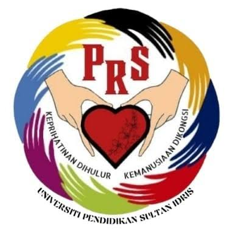

<div align="center">
  

  # PRS NEXUS

  **An integrated peer management and support system for Pembimbing Rakan Siswa.**

  A modern university portal for connecting members, coordinating committees,
  and keeping meetings and activities in one accessible place.

  [](https://laravel.com)
  [](https://www.php.net)
  [](https://tailwindcss.com)
  [](https://opensource.org/licenses/MIT)
</div>

---

## About the project

PRS NEXUS replaces scattered spreadsheets and manual records with a single platform for the PRS community at Universiti Pendidikan Sultan Idris (UPSI). Visitors can discover the organization through a public portal, members can manage their profiles and schedules, and administrators can maintain organizational records from a focused dashboard.

### What it provides

- A public landing page with community statistics and recent updates
- A searchable directory for members, committee roles, meetings, and activities
- A dedicated member portal with membership status, schedules, and profile management
- An administrative dashboard with summaries, recent records, and quick actions
- Full management of members, committee positions, meetings, and activities
- Session-based access control for member and administrator areas
- Responsive, accessible interfaces built around reusable Blade components

## User experiences

| Role | Capabilities |
| --- | --- |
| Public visitor | Explore PRS, browse the directory, and view community information |
| PRS member | Sign in, review upcoming meetings and activities, and update a personal profile |
| Administrator | Monitor the organization and manage members, committees, meetings, and activities |

## Built with

| Layer | Technology |
| --- | --- |
| Application | Laravel 12 · PHP 8.2+ |
| Interface | Blade · Tailwind CSS 4 · JavaScript |
| Assets | Vite 7 |
| Data | SQLite by default; Laravel-supported databases are configurable |
| Testing | PHPUnit 11 · Laravel HTTP tests |

## Getting started

### Prerequisites

Make sure the following are installed:

- PHP 8.2 or newer with the extensions required by Laravel
- Composer 2
- Node.js 20 or newer and npm
- SQLite, or another database supported by Laravel

### Installation

```bash
git clone 

composer install
npm install

cp .env.example .env
php artisan key:generate
```

Create the default SQLite database:

```bash
# macOS / Linux
touch database/database.sqlite

# Windows PowerShell
New-Item database/database.sqlite -ItemType File -ErrorAction SilentlyContinue
```

Prepare the application and sample data:

```bash
php artisan migrate --seed
php artisan storage:link
npm run build
```

Start the local development environment:

```bash
composer run dev
```

The application will be available at [http://localhost:8000](http://localhost:8000). The development command starts the web server, queue listener, log viewer, and Vite together.

> If you use Laragon, place the project in its `www` directory, complete the same installation steps, and open the local site URL generated by Laragon.

## Demo accounts

After running `php artisan migrate --seed`, use these credentials:

| Portal | Email | Password |
| --- | --- | --- |
| Administrator | `admin@prsnexus.test` | `password` |
| Member | `member@example.test` | `password` |

> Demo credentials are intended for local development only. Change or remove them before deploying the application.

## Useful commands

```bash
# Run the automated test suite
composer test

# Format PHP source files
./vendor/bin/pint

# Build production frontend assets
npm run build

# Reset the database and reload sample records
php artisan migrate:fresh --seed
```

## Project structure

```text
app/
├── Http/Controllers/     # Public, member, and admin request handling
├── Http/Middleware/      # Portal access checks
├── Http/Requests/        # Form validation
└── Models/               # Application data models
database/
├── migrations/           # Database schema
├── factories/            # Test data factories
└── seeders/              # Local demonstration data
resources/
├── css/                  # Tailwind theme and shared UI styles
├── js/                   # Frontend entry point
└── views/                # Blade pages, layouts, and components
routes/web.php            # Public and authenticated web routes
tests/Feature/            # End-to-end application behavior tests
```

## Configuration

The included `.env.example` uses SQLite and database-backed sessions, cache, and queues. To use MySQL, update the database section in `.env`:

```dotenv
DB_CONNECTION=mysql
DB_HOST=127.0.0.1
DB_PORT=3306
DB_DATABASE=prs_nexus
DB_USERNAME=root
DB_PASSWORD=
```

Then create the database and run `php artisan migrate --seed`.

## Render deployment (PostgreSQL)

The repository includes a production `Dockerfile` for a Render web service and
an [`.env.render.example`](.env.render.example) checklist for its environment
variables. The Docker image builds the Vite assets, installs PHP's PostgreSQL driver,
runs safe database migrations on startup, and listens on Render's `PORT`.

Before creating the web service, create a managed Render PostgreSQL database in
the same region. Copy its **Internal** connection details into the `DB_HOST`,
`DB_PORT`, `DB_DATABASE`, `DB_USERNAME`, and `DB_PASSWORD` environment variables.
Generate an application key locally with `php artisan key:generate --show`, then
set it as the `APP_KEY` secret in Render. Do not run the included demo seeders in
production: they create known demo passwords.

Member profile photos currently use Laravel's local `public` disk. Render's
normal service filesystem is ephemeral, so attach a persistent disk for
`storage/app/public` or move uploads to object storage before enabling real
avatar uploads.

## Testing

The feature suite covers public portal access, member and admin authentication, and management workflows for members, committee positions, meetings, and activities.

```bash
php artisan test
```

Tests use an isolated in-memory SQLite database as configured in `phpunit.xml`.

## Contributing

1. Fork the repository and create a feature branch.
2. Make a focused change and add or update tests where appropriate.
3. Run `composer test`, `./vendor/bin/pint`, and `npm run build`.
4. Open a pull request describing the problem and the chosen solution.


**THIS PROJECT HAS BEEN TESTED AND DEPLOYED FOR DEMO PURPOSES ON RENDER USING POSTGRESQL. POSTGRESQL CAN BE USED AS AN ALTERNATIVE TO MYSQL.**

## License

This project is open-source software licensed under the [MIT License](https://opensource.org/licenses/MIT).

<div align="center">
  Built to support a stronger, more connected student community.
</div>
